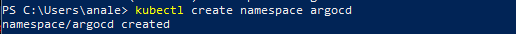
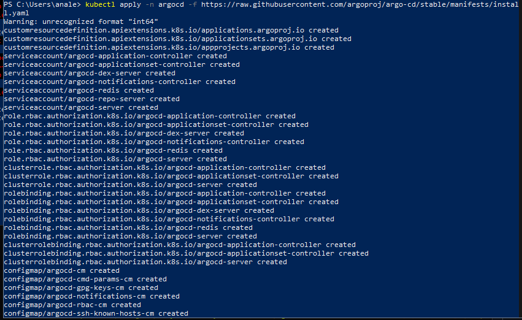
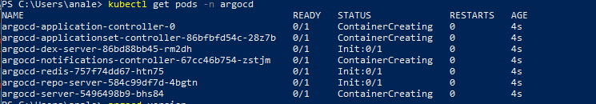
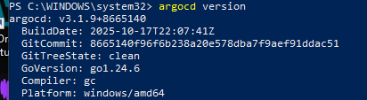
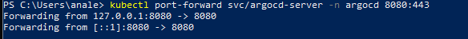
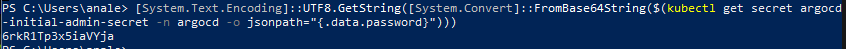
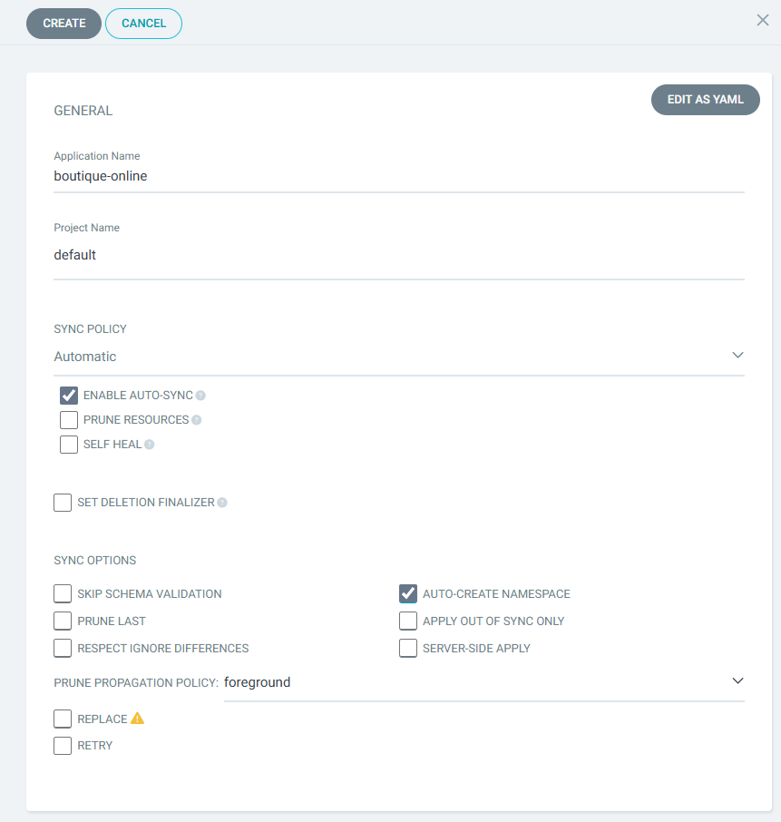
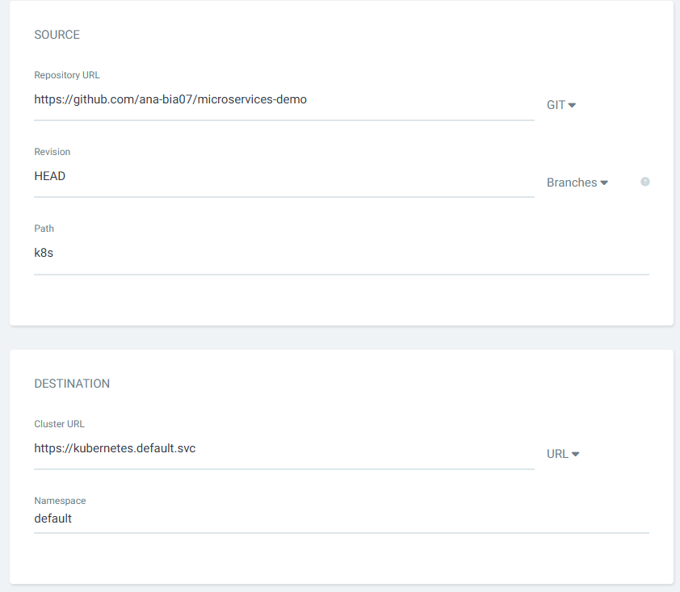
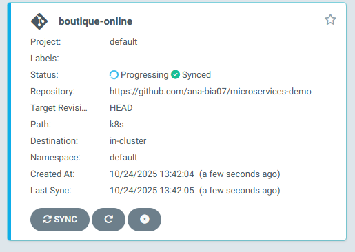
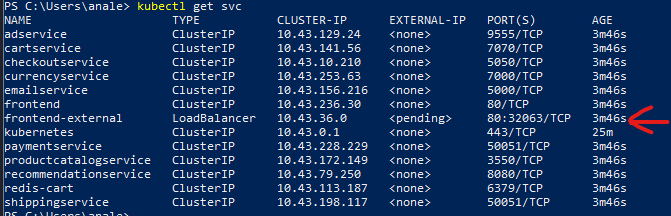

# GitOps


## 🧠 Instalação e Configuração do ArgoCD no Windows com Rancher

> Lembrando que todos os comandos foram executados em **Windows**, utilizando o **PowerShell**.  
> Alguns comandos podem variar caso você use outro sistema operacional.

---

## 🧩 Pré-requisitos
Antes de começar, instale as seguintes ferramentas:
- **Docker Local**  
  👉 [Instalar Docker Desktop](https://docs.docker.com/desktop/setup/install/windows-install/)

- **Rancher Desktop**  
  👉 [Instalar Rancher Desktop](https://rancherdesktop.io/)

- **Kubectl**  
  👉 [Documentação oficial Kubectl](https://kubernetes.io/pt-br/docs/tasks/tools/install-kubectl-windows/)

---
### 🤝Fork no Github
O primeiro passo sera fazer um fork com o repositorio: https://github.com/GoogleCloudPlatform/microservices-demo

Nomeie o repositorio com: microservices-demo

Em seguida crie uma nova pasta para ser nosso repositorio e abra o PowerShell. Execute:
```bash
cd C:\<caminho-pasta-criada>
git init
git remote add origin <LINK-PARA-REPOSITORIO_FORK>
git pull origin main
```
Exclua todos os arquivos e deixe apenas o release e o conteudo dele. Você pode usar o rkdir para excluir

Depois precisamos mudar o nome como comando bash mv:
```bash
mv release k8s
mv .\k8s\kubernetes-manifests.yaml .\k8s\online-botique.yaml
```

Nosso repositorio esta pronto.

### 🚀 Instalação do ArgoCD
Primeiro precisamos criar uma namespace para organizar e isolar recursos dentro do cluste:

```bash
kubectl create namespace argocd
```


Em seguida vamos instalar o argocd como operador:
```bash
kubectl apply -n argocd -f https://raw.githubusercontent.com/argoproj/argo-cd/stable/manifests/install.yaml
```


Verifique a instalação atravez desse comando:
```bash
kubectl get pods -n argocd #você deve ver algo como a imagem
```


### 💻 Instalação do ArgoCD CLI

Embora o ArgoCD possua uma interface gráfica, também podemos utilizá-lo via **CLI** (linha de comando) — como um bom programador raiz 😎.

Execute no **PowerShell**:

```powershell
$version = (Invoke-RestMethod https://api.github.com/repos/argoproj/argo-cd/releases/latest).tag_name
$url = "https://github.com/argoproj/argo-cd/releases/download/" + $version + "/argocd-windows-amd64.exe"
$output = "argocd.exe"
Invoke-WebRequest -Uri $url -OutFile $output 
```

Agora para a instalção permante e adicionar no path pelo terminal, execute:

!Abra o PowerShell **como administrador**!

```powershell
New-Item -ItemType Directory "C:\Program Files\ArgoCD" #cria uma pasta para o ArgoCD
Move-Item .\argocd.exe "C:\Program Files\ArgoCD\argocd.exe" #Move para a pasta criada
[Environment]::SetEnvironmentVariable("Path", "$env:Path;C:\Program Files\ArgoCD", "User") #Adiciona o argocd no path para que possa ser usado de qualquer lugar
```

Feche e abra novamente o PowerShell, depois verifique se a instalação deu certo:

```bash
argocd version
```


---

### 🔐 Autenticação no ArgoCD
Vamos verificar se os serviços estão correto:
```bash
kubectl get svc -n argocd
```
A saída deve mostrar algo como:
```
argocd-server   ClusterIP   10.106.197.216   <none>   80/TCP,443/TCP   76m
```

Agora vamos criar um tunel e temporario entre a maquia e o serviço argo.

```bash
kubectl port-forward svc/argocd-server -n argocd 8080:443
```

> ⚠️ **Importante:**  
> Esse comando cria um **túnel temporário** entre sua máquina e o serviço `argocd-server` dentro do cluster Kubernetes.  
> O terminal deve **permanecer aberto** enquanto você utiliza o ArgoCD.

Ao fazer o login, sera necessario uma senha. Não se preocupe, a senha pode ser adquirida atravez do comando:
```powershell
[System.Text.Encoding]::UTF8.GetString([System.Convert]::FromBase64String($(kubectl get secret argocd-initial-admin-secret -n argocd -o jsonpath="{.data.password}")))
```


Agora sim podemos logar:
Acesse o localhost:/8080 e insira:
- **Usuário:** `admin`  
- **Senha:** Copie e cole a senha exibida no terminal.


### 💻 Criando aplicação
Apos login podemos criar nossa primeira aplicação:
Insira as configurações como na foto:




Ele deve aparecer assim:



Aguarde por ate 10 minutos pois pode demorar. Execute novamente o comando e identifique o front-external
```bash
kubectl get svc
```


Em seguida:
```bash
kubectl port-forward svc/frontend 8080:80
```
E no navegador acesse:
http://localhost:8080 


## ✅ Conclusão

Agora você tem uma aplicação com kubernetes, rancher e argocd localmente.
Você aprendeu como instalar o argo e configurar. Use seu conhecimento e pratique!

###

📘 **Referências:**
- [Repositório do badtuxx - Descomplicando ArgoCD](https://github.com/badtuxx/DescomplicandoArgoCD)
